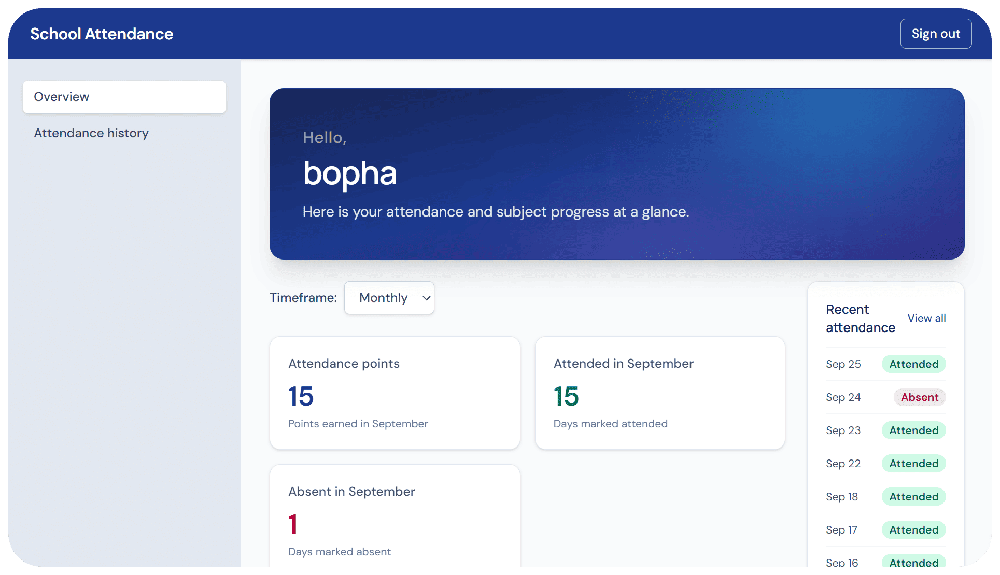

# School Attendance Project

Built @ [Step IT Academy (Touk Kouk Branch, Cambodia)](https://cambodia.itstep.org), Term 4, PHP Final Exam

## stuff

Hello! this is what we submitted for our final exam, a simple system that helps track attendance of students as well as marking their score in subjects

**Main Roles**
- Teachers
    - Can make student accounts, by making username and password
    - Mark attendance of students, they can select a given date and select from a table of students if theyre absent (by default, selecting date will select them as attended, but this won't save until you press save)
    - Can decide the score and performance of students, they can decide the default score and maximum score

- Students
    - They can see attendance history and total count of attendance, sorted from weekly, monthly, yearly and overall
    - They can also see score on given subject

## How to run
(This is based on using XAMPP control panel)
**You must have a mySQL server**
**Creation of database and seeding data is found at 127_0_0_1.sql**

1. Clone the repository to where you want it to be (for example, I'm gonna clone mines at C:\xampp\htdocs\\ and call it "php-schoolAttendance")

2. Run the seeded data into your mySQL server

3. Check the config.php file to make sure it matches your configuration 

4. Visit the link, here are some users you can use (must successfully finish Step 2):

| Username      | Password         | Role            |
| ------------- | ---------------- | --------------- |
| teacher       | 12345678         | bro its obvious |
| virakbothsoth | same as username | Student         |

5. Enjoy!